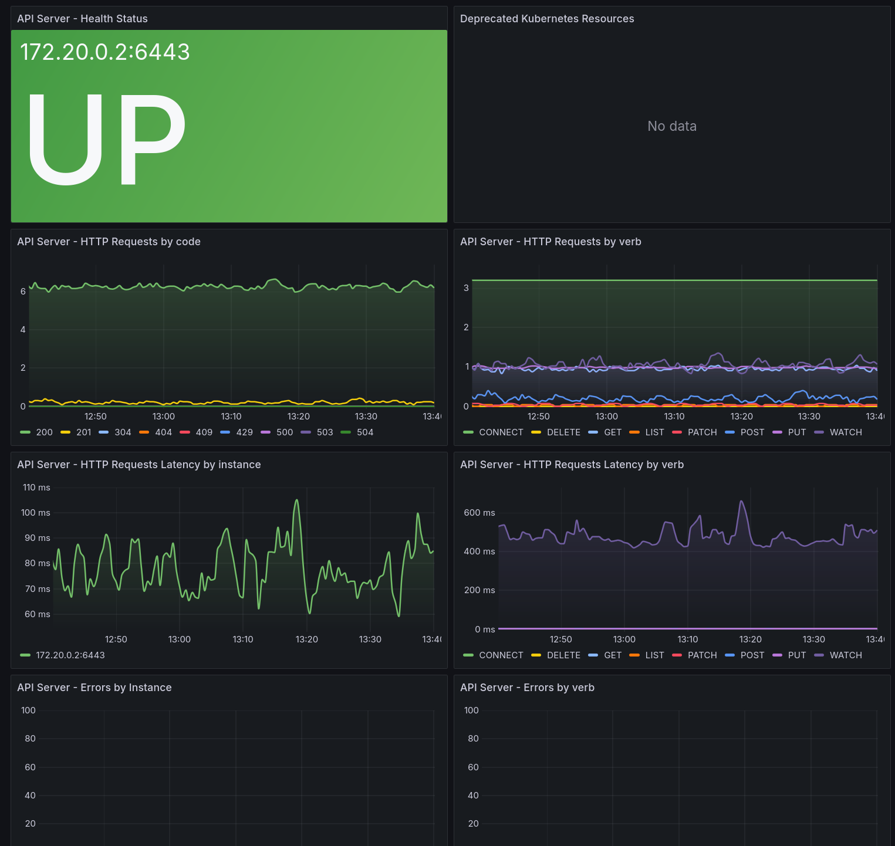

# (deprecated 2024-10-07)Note: this reposity will be upgraded to use k3s instead of k3d

# Setup home-lab cloud environment with ansible and k3d

This resposity contains instructions to setup home-lab cloud environment with ansible and k3d.
**Note**: This repository is to setup local cloud cluster. It is for local development, it is NOT for production usage.

## Base Usage

### 1. Setup inventory file

Create an inventory file under base folder. Or copy inventory-sample.yml to inventory and update it.

### 2. Run ansible playbook

```sh
ansible-playbook -i inventory playbook.yml --ask-pass --ask-become-pass
```

### 3. Check created k8s resources

Once the ansible book is done, there should be a kubernetes config file for new created cluster under folder `~/.kube/`.
e.g. `~/.kube/config-pi5`

```sh
export KUBECONFIG=~/.kube/config-pi5
kebuctl get all -A -o wide
```

### 4. Optional:Merge kube config into local kube config file

Merge the content of new kube config into local kube config (~/.kube/config),then use command to check:

```bash
kubectl get nodes -o wide
```

## Screenshot



